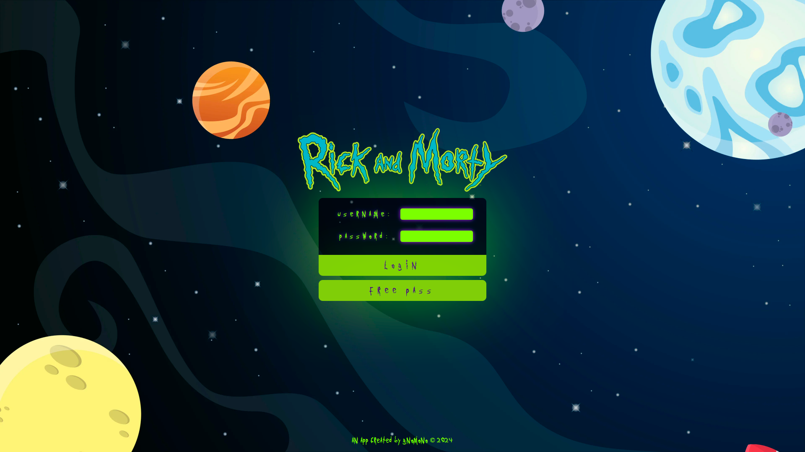

# React + Vite + Redux

index.html --> index.jsx --> App.jsx --> components

---

Comando de instalación Vite:
- Terminal en dir : Rick_and_Morty_app --> <i>npx create-vite@latest front</i> --> (Crea la carpeta front con la estructura de Vite)

npm run dev:
- Desarrollo.

Estilos:
- Módulos CSS

Dependencias:
- npx create vite@latest project-name
- npm install axios
- npm install react-router-dom
- npm install redux react-redux redux-thunk